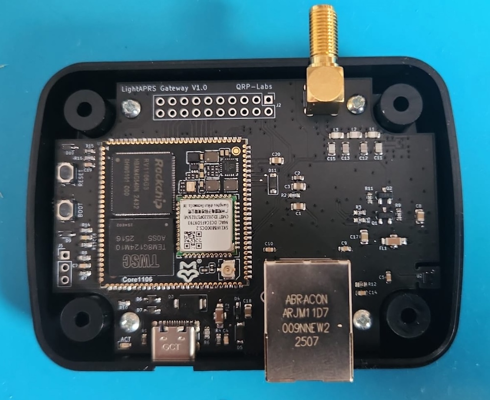
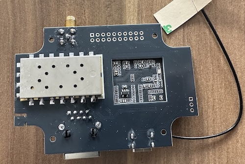
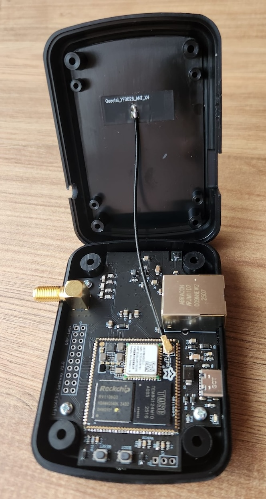
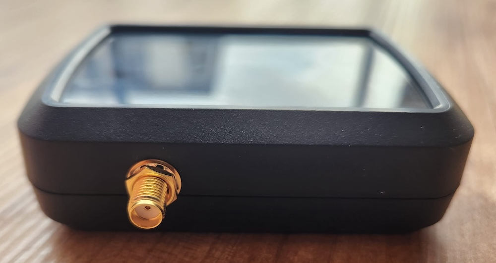
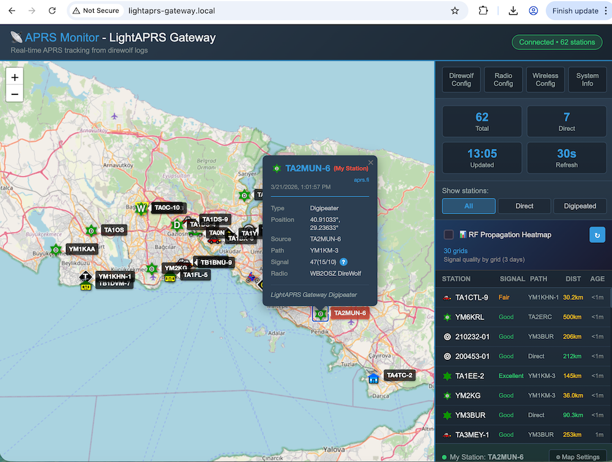

# LightAPRS Gateway

LightAPRS Gateway is a Linux-based APRS gateway development board featuring an SA818V VHF transceiver module, built-in WiFi 6, Direwolf software and a web-based management interface. Powered by the Rockchip RV1106 processor, it operates as a fully standalone APRS digipeater and iGate.

LightAPRS Gateway will be available on https://shop.qrp-labs.com for order soon.

**Important:** LightAPRS Gateway 1.0 operates on the amateur 2-meter (VHF) radio band with a 30 dBm (1W) output power, which typically requires an amateur radio license to operate in many countries. Therefore, if you are not a licensed HAM operator, please ensure to check local regulations and laws before purchasing the module.

## Quick Start — 3 Steps

LightAPRS Gateway is plug and play. Everything is pre-installed and pre-configured out of the box.

**1. Connect an antenna** to the SMA connector

**2. Power it up** via USB-C (any 5V USB adapter or computer)

**3. Set your callsign and location** — open `http://lightaprs-gateway.local` in your browser, go to **Direwolf Config**, and update `MYCALL` with your callsign and `PBEACON` with your coordinates. Click Save.

That's it — your APRS digipeater is on the air! For detailed instructions, see the [Getting Started](#getting-started) section below.

## Key Benefits

- SA818V VHF Transceiver (1W) with SMA Antenna Connector
- Pre-installed Linux OS (Ubuntu 22.04)
- Web-Based Configuration Interface and Local RF APRS Monitoring Map
- Built-in APRS Digipeater & iGate via [Direwolf](https://github.com/wb2osz/direwolf)
- WiFi 6 (2.4 GHz) + Ethernet for Network Connectivity + USB Type-C for Direct Connection
- SHTC3 Environmental Sensor (Temperature & Humidity)
- ABS Enclosure with Laser-Cut Openings for SMA, USB and Ethernet Connectors

## Basic Features

- **Software** : Open Source
- **Dimensions** : 58 x 82 mm
- **Platform** : [Luckfox Core1106](https://www.luckfox.com/Core1106) (Rockchip RV1106G3)
- **OS** : Linux (Ubuntu 22.04)
- **CPU** : ARM Cortex-A7 @ 1.2 GHz
- **NPU** : 1.0 TOPS (supports int4, int8, int16)
- **Ram** : 256 MB DDR3L
- **Storage** : 8 GB eMMC
- **WiFi** : 2.4 GHz WiFi 6 (AIC8800DC)
- **Bluetooth** : 5.2 / BLE
- **Input Voltage** : 5 Volt via USB Type-C 2.0
- **VHF Radio Module** : SA818V
- **VHF Operating Frequency** : 144 MHz (configurable)
- **VHF Max Power** : 30 dBm / 1W
- **Environmental Sensor** : SHTC3 (Temperature & Humidity)
- **Antenna Connector** : SMA Female (VHF), IPEX 1.0 (WiFi)
- **Ethernet** : 10/100M
- **Enclosure** : ABS Enclosure (88.5 x 63 x 27.5 mm)

## Software Features

- **APRS** : Digipeater & iGate operation via Direwolf 1.9 (dev)
- **Web Interface** : Built-in web UI for configuration and monitoring
  - APRS Monitor with live map and station list
  - Direwolf configuration editor
  - Radio settings (frequency, squelch, volume)
  - Wireless configuration
  - System information and diagnostics
- **Networking** : WiFi, Ethernet, USB RNDIS, mDNS discovery

## Getting Started

1. **[How to Connect for the First Time](https://github.com/lightaprs/LightAPRSGateway-1.0/wiki/How-to-Connect-for-the-First-Time)** — Power up your board and access the web interface or SSH
2. **[How to Change Passwords](https://github.com/lightaprs/LightAPRSGateway-1.0/wiki/How-to-Change-Passwords)** — Change default SSH and web interface passwords

## Guides

- **[Direwolf Configuration Guide](https://github.com/lightaprs/LightAPRSGateway-1.0/wiki/Direwolf-Configuration-Guide)** — Set up Digipeater, iGate, or both with sensor data
- **[Firmware Image Update Guide](https://github.com/lightaprs/LightAPRSGateway-1.0/wiki/Firmware-Image-Update-Guide)** — Re-flash the factory image if you need to restore the operating system

## Reference

- **[F.A.Q.](https://github.com/lightaprs/LightAPRSGateway-1.0/wiki/F.A.Q.)** — Frequently asked questions about radio, antenna, licensing, hardware, and software
- **[Firmware Repository](https://github.com/lightaprs/LightAPRSGateway-1.0-firmware)** — System internals, configuration files, and web interface source code (for advanced users)

## Support

If you have any questions or need support, please contact [support@lightaprs.com](mailto:support@lightaprs.com)

